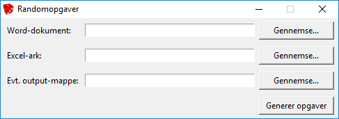

Randomopgaver
=============

Randomopgaver er et program til generering af [randomopgaver][rettestrategi].
Opgaverne genereres vha. et Microsoft Office Word-dokument, hvor der bestemte
steder er indsat pladsholdere. De tal eller ord, der skal indsættes i stedet for
disse pladsholdere, er angivet i en tabel i Excel- eller TXT-format.
Randomopgaverne (til eleverne) gemmes som PDF-filer, der har elevernes navne som
filnavne. Derudover kan der laves en ekstra udgave af hver fil, som også
indeholder svar (til læreren) – disse svar skal så også fremgå af Excel- eller
TXT-filen.


Installation
------------

Brug en installationsfil fra [releases][releases] under dette projekt.

Grafisk brugerflade
-------------------



Programmet startes fra startmenuen. I samme mappe i startmenuen ligger også to
eksempelfiler. Se mere information om Word-dokumentet og Excel-arket nedenfor.


Anvendelse
----------

### Excel-arket

Excel-arket skal have en form svarende til nedenstående:

| $Elevnavn$ | $tag1$  | $tag2$   | ... | $$svar1$$ | ... |
| -----------|---------| ---------|-----|-----------|-----|
| Navn1      | tal11   | tal12    | ... | indhold11 | ... |
| Navn2      | tal21   | tal22    | ... | indhold21 | ... |
| ...        | ...     | ...      | ... | ...       | ... |

Øverste linje indeholder de pladsholdere, der kan erstattes i Word-dokumentet.
Linjerne under indeholder det indhold, som kan skrives i stedet for
pladsholderne i PDF-dokumenterne. Hver linje svarer til indholdsdelene i hvert
sit PDF-dokument. F.eks. vil `$Elevnavn$` i Word-dokumentet blive erstattet med
`Navn1` i et PDF-dokument og `Navn2` er et andet. Ud fra samme række kan der
genereres to forskellige PDF-dokumenter: en Opgaver-version kun med opgaver og
en Svar-version med både opgaver og svar.

Der findes hertil to forskellige typer af pladsholdere:

- `$tag$`: Disse pladsholdere erstattes både med indhold i Opgaver-versioner og
Svar-versioner og bruges typisk til at indsætte tilfældige tal eller fortegn.

- `$$svar$$`: Disse pladsholdere fjernes i Opgaver-versioner og erstattes med
indhold i Svar-versioner og bruges typisk til at indsætte svarene på
opgaverne, så det bliver nemmere at rette afleveringerne. Hvis der ikke er
nogen overskrifter med `$$` i Excel-arket, så laves der ingen Svar-versioner.

Hold dig til bogstaverne a-z og tal i mellem $-tegnene i pladsholdernavne for at
undgå formateringsproblemer. NB: _`$Elevnavn$` erstattes også med elevens navn,
så det er muligt at gøre det synligt i dokumentet, hvem opgaven er tiltænkt._

Kolonner uden en pladsholder (`$tag` eller `$$svar$$`) i første række vil blive ignoreret, så de kan bruges til mellemregninger, kommentarer og andet.

Funktionen `SlumpMellem` i Excel kan bruges til et generere tilfældige heltal og
ved at dividere med titalspotenser kan dette også give decimaltal. Tal som skal
beregnes kan også beregnes vha. Excels formellinje. Se [tips og
tricks][excel-tips] til tilfældighed i Excel i [Wiki'en][wiki] her på projektsiden.


### Word-dokumentet

De steder, hvor tekst skal erstattes, skal der indsættes markeres med
pladsholdere (se ovenfor). NB: _Hvis en pladsholder indsættes i en formel i
Word, så skal det formateres som normal tekst (altså tekst der ikke står i
kursiv) for at de erstattes korrekt._ Det gøres ved at sætte citationstegn
omkring og trykke mellemrum efter det citerede. F.eks. skrives `"$tag$"`,
hvorefter cursoren places efter sidste citationstegn, og der trykkes på
mellemrumstasten – så vil man bemærke at teksten `"$tag$"` står i opretstående
form (modsat kursiv).

Hvis man gerne vil lave de ekstra PDF-filer med svar til opgaverne, så skal man
bruge en særlig notation ved de tags, der skal indsætte svar. Her bruges to
dollartegn ($$) både før og efter tag'ets navn, f.eks. `$$svar$$`.


### TXT-filen

TXT-filen er til dem, der ikke ønsker at bruge Excel til at lave tabellen med
pladsholdere og indhold, men foretrækker en anden metode. TXT-filen skal
formateres på præcis samme måde som Excel-filen.

Bemærk: TXT-filen skal bruge tabulatortegn (TAB) som "delimiter" mellem celler
og citationstegn (") som "quote character". Tegnkodningen i TXT-filen skal være
UTF-16LE (eller UCS-2 LE BOM) (hvilket er standard for dansk Excel ved eksport
til "Unicode-tekst").


Systemkrav
----------

For at køre programmet kræves:
- Windows (evt. vil Mac OS X understøttes senere)
- Microsoft Word 2007 eller nyere
- Microsoft Excel 2007 eller nyere (hvis du ikke laver en TXT-fil)

(Hvis du vælger at køre Python-filen med kildekoden direkte, så får du brug for
at installere de nødvendige Python-pakker.)


Kommandolinje-værktøj
---------------------

Ud over den grafiske brugerflade findes der et kommandolinje-værktøj, der
installeres sammen med brugerfladen. Denne ligger i samme programmappe.
Syntaks:

```
randomopgaver dokument tabelfil [output-mappe]

dokument        Stien til det Word-dokumentet hvori nogle tags skal udskiftes.
tabelfil        Stien til en tabelfil med tags og værdier til udskiftning.
                Filen kan enten være et Excel-ark eller en TXT-fil.
                I tilfælde af en TXT-fil anvendes separator (;),
                citationstegn (") og tegnkodning UTF-16LE.
output-mappe    Mappen hvor de genererede PDF-filer gemmes. Hvis ingen mappe
                angives, så vil PDF-filerne gemmes i undermapperne Opgaver og
                Svar til mappen, hvori Word-dokumentet ligger. Output-mappen
                oprettes, hvis den ikke findes i forvejen.
```

Indholdet i felterne fra Excel- eller TXT-filen `tabelfil` indsættes i indsættes
linje for linje i Microsoft Office Word-dokumentet `dokument`. Der er krav til
formatet af begge filer, som gennemgået i de to følgende afsnit. Se mere
information  om Word-dokumentet og Excel-arket/CSV-filen nedenfor.

Kendte mangler
--------------

 - Hvis der sker uforventede fejl (altså fejl uden et fejlmeldingsvindue på
   dansk), så kan Word- og Excel-vinduer forblive åbne i baggrunden. Disse skal
   så lukkes via Jobliste eller lukkes, når computeren genstartes. (Det drejer
   sig højst om et vindue af hver type pr. kørsel.)


Licens
------

Dette projekt bruger MIT License – se [LICENSE][license]-filen.


Tak
---

- Tak til kcida10 for at dele [One_die][One_die] (billedet til program-ikonet).
  Se billedets licens ved at følge linket.


[excel-tips]: https://github.com/jensjacobt/randomopgaver/wiki/Excel:-Tips-og-tricks
[license]: https://github.com/jensjacobt/randomopgaver/blob/master/LICENSE
[One_die]: https://commons.wikimedia.org/wiki/File:One_die.jpeg
[releases]: https://github.com/jensjacobt/randomopgaver/releases
[rettestrategi]: https://rettestrategi.wordpress.com/modul-6-random-opgaver/
[wiki]: https://github.com/jensjacobt/randomopgaver/wiki
